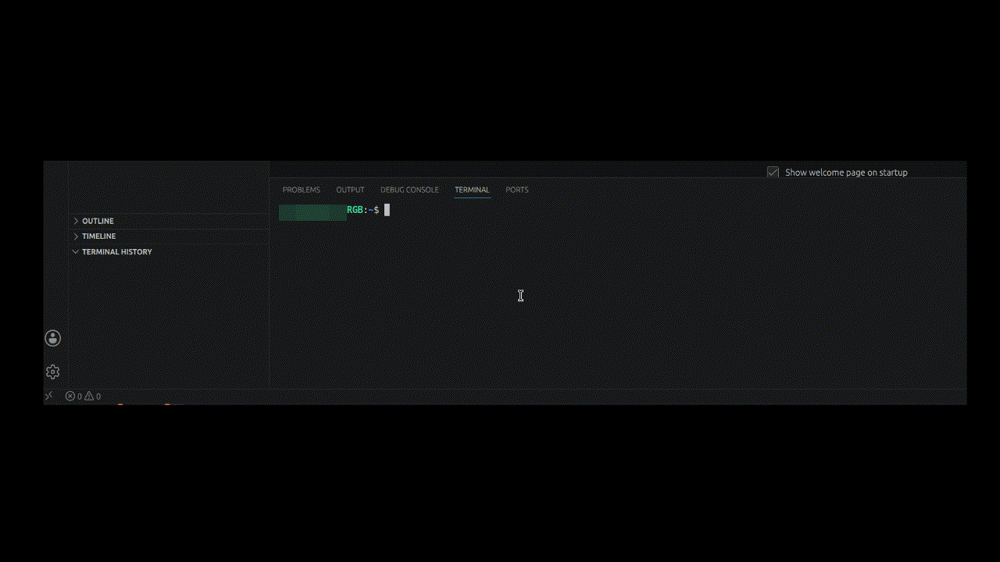

# Terminal Velocity

[](https://github.com/chamren86/terminal-velocity)
[](https://code.visualstudio.com/)
[](LICENSE)
[](https://github.com/chamren86/terminal-velocity/releases/latest/download/terminal-velocity-1.0.0.vsix)

View and manage your terminal command history directly in the VS Code Explorer outline view.

## Features

- 📝 **Command History** - Automatically captures every command and its output
- 🟢/🔴/🟡 **Status Indicators** - Shows success, failure, or running status
- 🔧 **Actions** - Rerun commands, copy output, clear history
- 🔒 **Security** - Detects and redacts passwords, API keys, and tokens (v0.4.0)
- 📊 **Privacy Dashboard** - View and manage your security settings
- 🎨 **Clean Display** - Strips ANSI codes and shows clean output
- 💾 **Persistent** - History survives VS Code restarts

## Demo

<div align="center">
  
  <p><em>Terminal Velocity in action</em></p>
</div>

### From VSIX (Manual Download)

1. Download the latest `.vsix` file:
   - From [GitHub Releases](https://github.com/chamren86/terminal-velocity/releases)
   - Or via direct link: [Download Latest VSIX](https://github.com/chamren86/terminal-velocity/releases/latest/download/terminal-velocity-1.0.0.vsix)

2. Install the extension:
   - **VS Code UI**: Extensions → `...` → Install from VSIX → Select the file
   - **Command Line**: `code --install-extension terminal-velocity-1.0.0.vsix`

### From VS Code Marketplace
The extension will be available on the Marketplace after beta testing.

### From Source (For Development)

```
git clone https://github.com/chamren86/terminal-velocity.git
cd terminal-velocity
npm install
npm run compile
```

Press F5 to launch the extension in a development window.

## Usage

1. Open a terminal (`` Ctrl+` ``)
2. Run any command - it appears in the Terminal History view (Explorer sidebar)
3. Click a command to see its output
4. Right-click for actions: Rerun, Copy Output

### Commands

| Command | Description |
|---------|-------------|
| `Clear Terminal History` | Clear all saved commands |
| `Rerun Command` | Re-run the selected command |
| `Copy Output` | Copy command output to clipboard |
| `Privacy Dashboard` | View and manage security settings |

## Configuration

VS Code settings (`Ctrl+,`):

```
{
    "terminalHistory.maxHistorySize": 100,
    "terminalHistory.security.detectionEnabled": true,
    "terminalHistory.security.redactionLevel": "warn",
    "terminalHistory.security.warnOnDetection": true,
    "terminalHistory.security.customPatterns": [],
    "terminalHistory.security.excludedCommands": []
}
```

### Security Settings

| Setting | Values | Description |
|---------|--------|-------------|
| `detectionEnabled` | true/false | Enable/disable sensitive data detection |
| `redactionLevel` | off/warn/redact/block | How to handle sensitive data |
| `warnOnDetection` | true/false | Show warning when sensitive data is detected |
| `customPatterns` | string[] | Custom regex patterns for detection |
| `excludedCommands` | string[] | Commands to never save (regex supported) |

## Development

### Prerequisites
- Node.js 18+
- npm

### Setup

```
git clone https://github.com/chamren86/terminal-velocity.git
cd terminal-velocity
npm install
npm run compile
```

### Testing

| Command | Description | When to Use |
|---------|-------------|-------------|
| `npm test` | Run all unit tests | During development |
| `npm run test:unit` | Quick tests (fast) | Rapid development |
| `npm run test:full` | Full suite with clean install | Before commit |
| `npm run test:act` | Run GitHub Actions locally | Test CI/CD locally |
| `npm run precommit` | Check uncommitted changes | Before committing |
| `npm run prepush` | Full validation | Before pushing |

### Install `act` for GitHub Actions Testing (Optional)
To test GitHub Actions locally:
- **Ubuntu/Debian**: `curl -s https://raw.githubusercontent.com/nektos/act/master/install.sh | sudo bash`
- **macOS**: `brew install act`
- **Windows**: `choco install act`
- **More info**: https://github.com/nektos/act

### Project Structure

```
src/
├── cleaner.ts              # ANSI cleaning
├── extension.ts            # Extension activation
├── security.ts             # Security module
├── privacyCommands.ts      # Privacy dashboard commands
├── terminalHistoryProvider.ts # Tree provider
└── test/                   # Unit tests
    ├── unit/
    │   ├── ansiCleanerTest.ts    # ANSI cleaning tests
    │   └── securityTest.ts       # Security tests
    └── fixtures/
        └── sampleOutputs.ts      # Test data
```

## Requirements

- VS Code 1.93+
- Shell Integration enabled (default: on)

### Enabling Shell Integration
If commands aren't being captured, ensure Shell Integration is enabled:
1. Open VS Code Settings (Ctrl+,)
2. Search for "shell integration enabled"
3. Check `Terminal > Integrated > Shell Integration: Enabled`

## Roadmap

**v1.1.0** - Groups & Organization  
**v1.2.0** - AI & Agent Integration  
**v1.3.0** - Export & Save  
**v1.4.0** - Customization & UX  

[Full Roadmap](docs/ROADMAP.md)
[Feature Details](docs/FEATURES.md)

## Release Notes

[Full Release Notes](docs/RELEASE-NOTES.md)

## License

MIT © [chamren86](https://github.com/chamren86)

---

**Enjoy tracking your terminal history!** 🚀